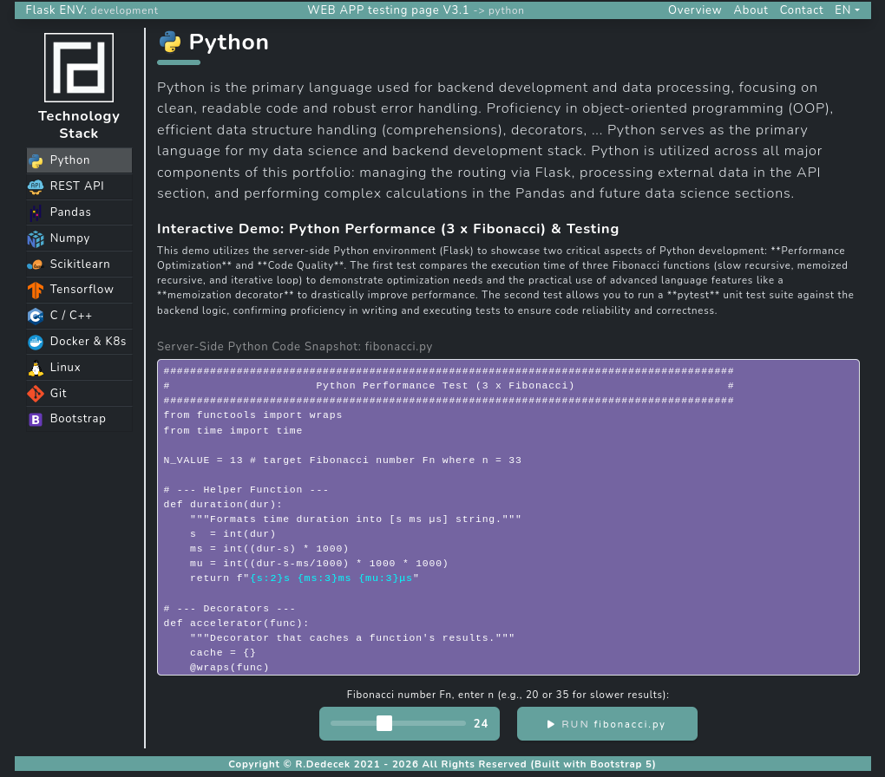
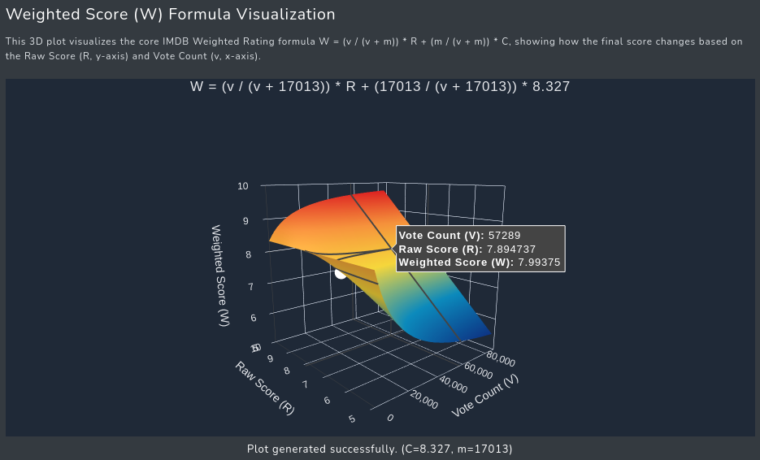

# Portfolio & Technology Stack Demos

An interactive web application showcasing a modern technology stack, built with **Python/Flask**, **Google Cloud Run**, and **Firebase**.

Designed to demonstrate full-stack proficiency, this project serves as both a technical playground and a showcase of my backend engineering skills.
 

## 🌐 Live Demo
View the Live Application: [**radimirdedecek.com**](https://radimirdedecek.com)

## 🚀 Key Features

* **TensorFlow Integration**: Real-time handwritten digit recognition.
* **Data Science Demos**: 3D surface plots using Scikit-Learn and Plotly.
* **RESTful API**: Integration with TMDB for movie data processing.
* **Cloud Architecture**: Containerized deployment on Google Cloud Run.

## 🛠️ Technology Stack

* **Backend**: Python 3, Flask, Gunicorn
* **Frontend**: Bootstrap 5, Jinja2, Vanilla JavaScript
* **DevOps**: Docker, Google Cloud Run, Git

## 📸 Project Screenshots

**Portfolio Overview:**

**Performance Benchmark (C vs Python):**
")

**Scikit-learn Regression:**

## 📜 License & Usage

Copyright (c) 2026 Radimir Dedecek. All Rights Reserved.
The source code is provided for **portfolio review purposes only**.

## ✍️ Author

**Radimir Dedecek** Full-Stack Developer with a primary focus on Backend engineering

